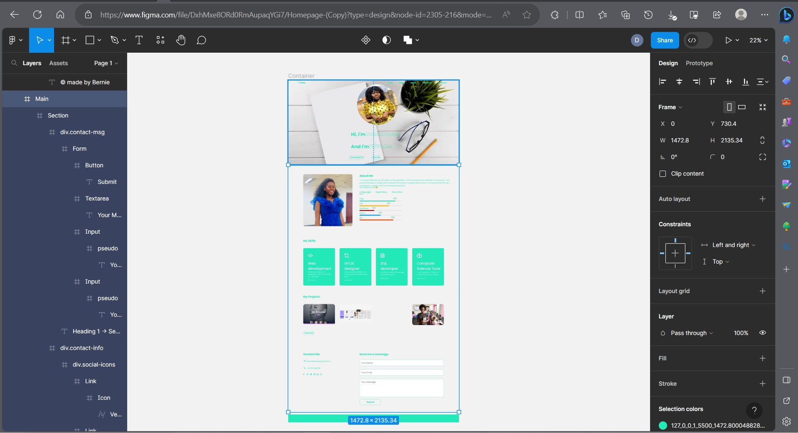
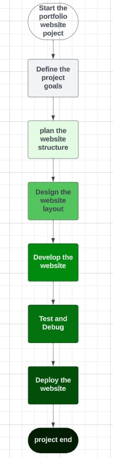

# Portfolio Website Project

## Project Overview
The portfolio website project is a website that showcases someone's skills, projects, and achievements. Its purpose is to serve as a professional online presence to showcase your work and attract potential employers or clients. It allows you to present your expertise, experience, and portfolio in a visually appealing and interactive manner.

This project aims to solve the problem of effectively presenting your work and skills to others in a concise and visually appealing way. It brings value to users by providing a centralized platform to highlight their achievements and capabilities, making it easier for potential clients or employers to assess their suitability for a particular job or project.

In this case, I'll create my own portfolio website.

## Features and Functionality
- Home Page: Introduce my and provide a brief overview of my skills and experience.
- Portfolio Section: Showcasing my projects through images, descriptions, and links.
- Skills Section: Highlight my technical skills and areas of expertise.
- Resume/CV: Provide a downloadable version of my CV for users to access.
- Contact Form: Allow visitors to contact me through a contact form for direct inquiries.

Users can navigate through the website using the menu and interact with different sections to learn more about your work and skills. Notable aspects or unique selling points could include a visually appealing design, smooth navigation, responsive layout for different devices, and interactive elements to engage visitors.

## Technologies Used
- HTML, CSS: Structuring and styling the website.
- JavaScript: Adding interactivity and dynamic elements.
- Git: Version control system for project management.

## Screenshots or Demo

Demo: Live Demo 

## Roadmap and Future Enhancements
In the future I plan to : 
- Enhance the portfolio section with project filtering/categorization options.
- Incorporate a blog section to share articles or insights related to my field.
- Integrate social media links to connect with visitors on different platforms.
- Implement analytics to track website metrics and visitor engagement.
- Optimize website performance for faster loading and better user experience.

## Contact Information
- Name: Dounla Enricka Bernie
- Email: dounlabernie@gmail.com
